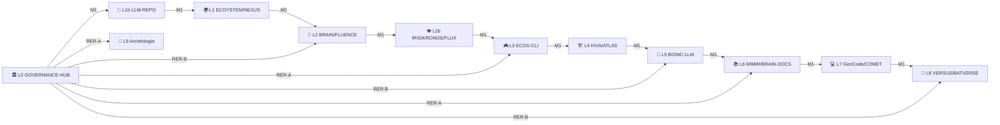

# EPIC-02 — Réseau de Transit Cognitif

---

**EPIC** : EPIC-02  
**Titre** : Transit Map — Lignes Métro, RER, Tram, Bus, Noctilien  
**PRD parent** : `PRD/PRD_URBAN_ONTOLOGY_VERSE_V1.md`  
**Version** : 1.0.0  
**Date** : 2026-05-28  
**Statut** : 🟡 À DÉMARRER  
**Priorité** : P1 — Dépend de EPIC-01  
**Dépendances** : EPIC-01 terminé

---

## Objectif

Formaliser le **réseau de transport cognitif** de l'écosystème :
documentation YAML de toutes les lignes, diagramme Mermaid du réseau,
synchronisation avec `boot_sequence.md` dans LLM-REPO.

## User Stories

| ID | Story | Critères d'acceptation |
|----|-------|----------------------|
| US-02-1 | En tant qu'agent LLM, je consulte le plan du métro pour choisir ma route d'ingestion | `transit_map.yaml` lisible et complet |
| US-02-2 | En tant que dev, je visualise le réseau en diagramme | `transit_map.mermaid.md` généré |
| US-02-3 | En tant qu'agent LLM, je prends le Noctilien en session light | Ligne N1 documentée et référencée dans boot_sequence |
| US-02-4 | En tant que mainteneur, je peux ajouter une ligne de tram pour un nouveau groupe de repos | Template `tram_line_template.yaml` disponible |

## Tâches techniques

- [ ] Créer `urban_ontology_verse/TRANSIT/transit_map.yaml` (contenu §4 du PRD)
- [ ] Créer `urban_ontology_verse/TRANSIT/transit_map.mermaid.md` (diagramme visuel)
- [ ] Créer `urban_ontology_verse/TRANSIT/tram_lines.yaml` (manifeste vagues tram)
- [ ] Créer `urban_ontology_verse/TRANSIT/tram_line_template.yaml`
- [ ] Créer `urban_ontology_verse/TRANSIT/bus_routes.yaml` (groupes de repos + règle livrée)
- [ ] Notifier LLM-REPO : ajouter référence `transit_map.yaml` dans `boot_sequence.md`

## Diagramme Mermaid cible

## Définition de "Done"

- [ ] `transit_map.yaml` complet et validé
- [ ] Diagramme Mermaid rendu sans erreur
- [ ] `boot_sequence.md` (LLM-REPO) référence `transit_map.yaml`
- [ ] PR soumise avec review par l'humain
