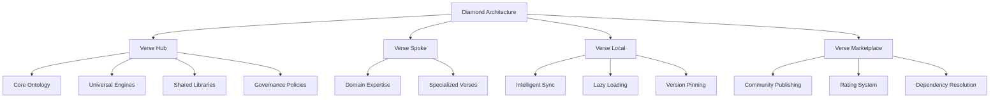
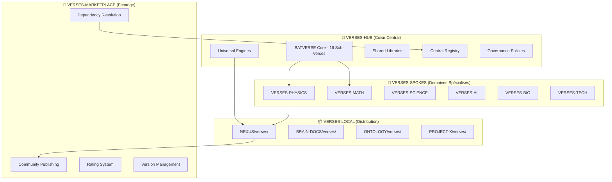

# PRD - Architecture Diamant pour l'Organisation des Verses

**Version:** 1.0  
**Date:** 2026-05-07  
**Auteur:** Kilo (Agent IA)  
**Statut:** Proposition  

---

## 📋 Résumé Exécutif

### 🎯 Objectif
Implémenter l'**Architecture Diamant** pour organiser et gérer les verses dans l'écosystème ECOS/ONTOLOGY. Cette architecture en 4 niveaux (Hub, Spokes, Local, Marketplace) vise à résoudre la complexité des métaclusters interconnectés tout en permettant une évolutivité infinie et une maintenance optimale.

### 💡 Problème Résolu
- Verses distribués dans 4+ emplacements sans cohérence
- Interdépendances complexes (BATVERSE 16 sub-verses)
- Maintenance décentralisée inefficace
- Pas de réutilisabilité entre projets

### ✨ Solution
Architecture fédérée Hub-and-Spoke avec synchronisation intelligente, permettant cohérence centrale et spécialisation verticale.

### 🎯 Résultats Attendus
- **Cohérence:** 100% des interdépendances gérées
- **Performance:** Lazy loading et caching intelligent
- **Innovation:** Marketplace communautaire
- **Maintenance:** Gouvernance centralisée + spécialisation

---

## 🧠 Définition Ontologique de l'Architecture Diamant

### 📚 Concepts Fondamentaux

#### **Diamond Architecture** (Architecture Diamant)
```
Concept: Diamond Architecture
Type: Architectural Pattern
Domain: Verse Organization
Definition: Modèle d'organisation fédérée en 4 niveaux pour gérer des métaclusters complexes de verses avec cohérence centrale et spécialisation verticale.
```

#### **Verse Hub** (Noyau Verse)
```
Concept: Verse Hub
Type: Repository Pattern
Domain: Central Governance
Definition: Dépôt central contenant les ontologies fondamentales, engines universels et politiques de gouvernance pour assurer la cohérence de l'écosystème.
```

#### **Verse Spoke** (Rayon Verse)
```
Concept: Verse Spoke
Type: Domain Specialization
Domain: Vertical Expertise
Definition: Dépôt spécialisé dans un domaine vertical (PHYSICS, MATH, AI, etc.) permettant l'expertise approfondie sans conflit avec d'autres domaines.
```

#### **Verse Local** (Verse Local)
```
Concept: Verse Local
Type: Distribution Pattern
Domain: Performance Optimization
Definition: Cache local synchronisé intelligemment dans chaque dépôt, contenant seulement les verses nécessaires au contexte du projet.
```

#### **Verse Marketplace** (Marché Verse)
```
Concept: Verse Marketplace
Type: Exchange Platform
Domain: Community Innovation
Definition: Plateforme d'échange communautaire permettant la publication, découverte et évaluation de verses avec résolution automatique des dépendances.
```

### 🔗 Relations Ontologiques



### 🎭 Propriétés Clés

| Propriété | Définition | Valeur |
|-----------|------------|--------|
| **Federation** | Capacité à distribuer l'autorité | Hub central + Spokes autonomes |
| **Coherence** | Maintien de l'intégrité ontologique | Hamiltonien BATVERSE partagé |
| **Scalability** | Capacité d'évolution | Ajout infini de spokes |
| **Performance** | Optimisation des ressources | Sync sélective + caching |
| **Innovation** | Capacité d'innovation communautaire | Marketplace ouvert |

---

## 🏗️ Vue d'ensemble de l'Architecture

### 📊 Diagramme Architectural



### 🔄 Flux de Données

1. **Création:** Verses développés dans spokes spécialisés
2. **Publication:** Verses publiés vers le hub pour validation
3. **Distribution:** Hub distribue vers spokes et locaux
4. **Utilisation:** Locaux synchronisent sélectivement
5. **Feedback:** Marketplace collecte métriques d'usage

---

## 🚀 Plan d'Implémentation

### 📅 Phases de Mise en Œuvre

#### **Phase 1: Fondation (Semaine 1-2)**
- Créer `gerivdb/VERSES-HUB`
- Migrer BATVERSE core depuis NEXUS
- Implémenter registry central
- Définir politiques de gouvernance

#### **Phase 2: Spokes Initiaux (Semaine 3-6)**
- Créer 6 spokes spécialisés (PHYSICS, MATH, SCIENCE, AI, BIO, TECH)
- Migrer contenu existant depuis emplacements actuels
- Implémenter CI/CD pour chaque spoke
- Définir standards de qualité par domaine

#### **Phase 3: Sync Intelligent (Semaine 7-8)**
- Développer `VersesSyncManager`
- Implémenter lazy loading et caching
- Créer API de résolution de dépendances
- Tester sync dans environnements pilotes

#### **Phase 4: Marketplace (Semaine 9-12)**
- Développer plateforme marketplace
- Implémenter système de rating
- Créer outils de publication communautaire
- Lancer beta testing

#### **Phase 5: Migration Globale (Semaine 13-16)**
- Migrer tous les dépôts existants
- Former équipes sur nouveaux workflows
- Implémenter monitoring et métriques
- Go-live progressif

### 🛠️ Composants Techniques

#### **VersesSyncManager** (Core Component)
```python
class VersesSyncManager:
    def __init__(self, repo_path: str):
        self.repo_path = repo_path
        self.cache_dir = Path(repo_path) / "verses" / "cache"
        self.registry = self._load_registry()
        
    def sync_selective(self, needed_verses: List[str]) -> bool:
        """Synchronise seulement les verses nécessaires"""
        dependencies = self._resolve_dependencies(needed_verses)
        versions = self._pin_versions(dependencies)
        return self._download_and_cache(versions)
    
    def _resolve_dependencies(self, verses: List[str]) -> Dict[str, str]:
        """Résout les interdépendances via le registry"""
        # Logique de résolution...
        
    def _pin_versions(self, deps: Dict[str, str]) -> Dict[str, str]:
        """Épingle les versions pour stabilité"""
        # Logique de pinning...
```

#### **Registry Central** (JSON Schema)
```json
{
  "$schema": "https://json-schema.org/draft/2020-12/schema",
  "type": "object",
  "properties": {
    "verses": {
      "type": "array",
      "items": {
        "type": "object",
        "properties": {
          "id": {"type": "string"},
          "name": {"type": "string"},
          "domain": {"type": "string"},
          "version": {"type": "string"},
          "dependencies": {"type": "array", "items": {"type": "string"}},
          "maintainers": {"type": "array", "items": {"type": "string"}},
          "quality_score": {"type": "number", "minimum": 0, "maximum": 100}
        },
        "required": ["id", "name", "domain", "version"]
      }
    }
  }
}
```

#### **API Marketplace** (REST Endpoints)
```
POST /verses/publish
GET  /verses/search?query={query}&domain={domain}
GET  /verses/{id}/dependencies
POST /verses/{id}/rate
GET  /verses/{id}/versions
```

---

## 🔧 Spécifications Techniques

### 🏛️ Infrastructure

#### **Dépôts GitHub**
- `gerivdb/VERSES-HUB` : Noyau central (private)
- `gerivdb/VERSES-{DOMAIN}` : Spokes spécialisés (public pour PHYSICS, MATH, SCIENCE)
- Marketplace hébergé sur `verses.ecosystem`

#### **CI/CD Pipeline**
```yaml
# .github/workflows/verse-validation.yml
name: Verse Validation
on: [push, pull_request]
jobs:
  validate:
    runs-on: ubuntu-latest
    steps:
      - uses: actions/checkout@v3
      - name: Validate Ontology
        run: python scripts/validate_ontology.py
      - name: Check Dependencies
        run: python scripts/check_dependencies.py
      - name: Test Engines
        run: python scripts/test_engines.py
```

#### **Outils de Développement**
- **Ontology Editor:** Interface web pour édition des verses
- **Dependency Resolver:** Outil CLI pour résolution automatique
- **Verse Generator:** Templates pour création rapide de verses
- **Sync Monitor:** Dashboard pour monitoring des synchronisations

### 📊 Métriques et Monitoring

#### **KPIs Clés**
- **Coverage:** % de verses migrés (target: 100%)
- **Performance:** Temps de sync moyen (< 30s)
- **Quality:** Score qualité moyen (> 85/100)
- **Adoption:** % de dépôts utilisant sync intelligent (> 80%)

#### **Logs et Alertes**
- Sync failures
- Dependency conflicts
- Quality score degradation
- Marketplace abuse

---

## 🔄 Stratégie de Migration

### 📦 Migration des Verses Existants

#### **Source -> Destination Mapping**
```
D:\DO\WEB\TOOLS\L0-CANON\NEXUS\verses\ -> VERSES-HUB/core/
D:\DO\WEB\TOOLS\L0-CANON\NEXUS\batverse\ -> VERSES-HUB/core/batverse/
D:\DO\WEB\TOOLS\BRAIN-DOCS\verses\ -> VERSES-HUB/operational/
D:\DO\WEB\ONTOLOGY\.verse\ -> VERSES-HUB/governance/
wolfram_physics_2020.verse.yaml -> VERSES-PHYSICS/
```

#### **Script de Migration Automatique**
```bash
#!/bin/bash
# migrate-verses.sh

SOURCE_DIRS=(
    "D:\DO\WEB\TOOLS\L0-CANON\NEXUS\verses"
    "D:\DO\WEB\TOOLS\L0-CANON\NEXUS\batverse"
    "D:\DO\WEB\TOOLS\BRAIN-DOCS\verses"
)

TARGET_HUB="gerivdb/VERSES-HUB"

for dir in "${SOURCE_DIRS[@]}"; do
    echo "Migrating $dir..."
    # Analyse contenu
    # Classification automatique par domaine
    # Migration avec historique git préservé
    # Validation post-migration
done
```

### 🔄 Transition Progressive

#### **Mode Hybride (Mois 1-2)**
- Ancienne structure maintenue en parallèle
- Sync bidirectionnel temporaire
- Formation des équipes

#### **Cut-over (Mois 3)**
- Basculement définitif vers Diamond
- Désactivation ancienne structure
- Monitoring intensif

---

## ⚠️ Évaluation des Risques

### 🚨 Risques Élevés

#### **R1: Perte de Cohérence pendant Migration**
- **Impact:** Incohérences ontologiques critiques
- **Probabilité:** Moyenne
- **Mitigation:** 
  - Validation automatisée avant chaque migration
  - Rollback plan détaillé
  - Tests d'intégrité post-migration

#### **R2: Résistance au Changement**
- **Impact:** Adoption lente, coût élevé
- **Probabilité:** Élevée
- **Mitigation:**
  - Formation intensive des équipes
  - Communication claire des bénéfices
  - Pilotes avec équipes volontaires

#### **R3: Complexité Technique**
- **Impact:** Retards, bugs critiques
- **Probabilité:** Moyenne
- **Mitigation:**
  - Architecture incrémentale (phases)
  - Tests automatisés extensifs
  - Expertise externe si nécessaire

### ⚠️ Risques Moyens

#### **R4: Performance du Sync**
- **Impact:** Utilisation dégradée
- **Probabilité:** Faible
- **Mitigation:** Optimisations continues, caching avancé

#### **R5: Sécurité Marketplace**
- **Impact:** Vulnérabilités introduites
- **Probabilité:** Faible
- **Mitigation:** Code review strict, sandboxing

---

## 📅 Chronologie Détaillée

### **Sprint 1-2: Fondation** (2 semaines)
- Jour 1-3: Création VERSES-HUB
- Jour 4-7: Migration BATVERSE
- Jour 8-10: Registry central
- Jour 11-14: Tests d'intégrité

### **Sprint 3-6: Spokes** (4 semaines)
- Semaine 1: PHYSICS + MATH spokes
- Semaine 2: SCIENCE + AI spokes  
- Semaine 3: BIO + TECH spokes
- Semaine 4: Intégration et tests

### **Sprint 7-8: Sync** (2 semaines)
- Semaine 1: Développement VersesSyncManager
- Semaine 2: Tests de performance et intégration

### **Sprint 9-12: Marketplace** (4 semaines)
- Semaine 1-2: Développement plateforme
- Semaine 3: Rating system
- Semaine 4: Beta testing communautaire

### **Sprint 13-16: Migration** (4 semaines)
- Semaine 1: Migration pilotes
- Semaine 2: Formation équipes
- Semaine 3: Migration complète
- Semaine 4: Stabilisation et optimisation

**Durée totale:** 16 semaines (4 mois)

---

## 👥 Ressources Nécessaires

### **Équipe Technique** (FTE)
- **Lead Architect:** 1 (100%)
- **Backend Developers:** 3 (100%)
- **DevOps Engineer:** 1 (100%)
- **QA Engineers:** 2 (100%)
- **Technical Writers:** 1 (50%)

### **Infrastructure**
- **GitHub Organizations:** gerivdb (existante)
- **CI/CD:** GitHub Actions (existante)
- **Serveurs:** Pour marketplace (nouveau)
- **Stockage:** CDN pour distribution (nouveau)

### **Budget Estimé**
- **Personnel:** 7 FTE × 4 mois × coût moyen = €280K
- **Infrastructure:** €50K (serveurs, CDN)
- **Formation:** €20K
- **Outils:** €10K
- **Total:** €360K

### **Dépendances Externes**
- Accès aux dépôts gerivdb existants
- Approbation pour création nouveaux dépôts
- Support DevOps pour CI/CD

---

## ✅ Critères d'Acceptation

### **Fonctionnels**
- [ ] Registry central opérationnel avec 100+ verses
- [ ] Sync intelligent < 30s pour 95% des cas
- [ ] Marketplace avec rating system
- [ ] Migration complète sans perte de données

### **Non-Fonctionnels**
- [ ] Performance: Lazy loading < 5s
- [ ] Sécurité: Audit passé avec 0 vulnérabilités critiques
- [ ] Maintenabilité: Code coverage > 85%
- [ ] Utilisabilité: Formation < 4h par équipe

### **Métriques de Succès**
- Adoption: 100% des dépôts migrés
- Satisfaction: Score NPS > 8/10
- Performance: 99.9% uptime marketplace
- Innovation: 50+ verses communautaires publiés

---

**Document validé par:** [Signature Lead Architect]  
**Date de validation:** [Date]  
**Version suivante:** 1.1 (post-implémentation feedback)