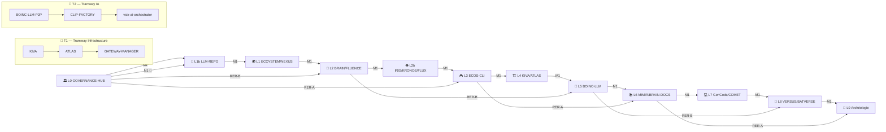

```mermaid
graph LR
    L0["🏛️ L0 GOVERNANCE-HUB"] -->|"M1"| L1b["🧭 L1b LLM-REPO"]
    L1b -->|"M1"| L1["🌍 L1 ECOYSTEM/NEXUS"]
    L1 -->|"M1"| L2["🧠 L2 BRAIN/FLUENCE"]
    L2 -->|"M1"| L2b["👁️ L2b IRIS/KRONOS/FLUX"]
    L2b -->|"M1"| L3["🎮 L3 ECOS-CLI"]
    L3 -->|"M1"| L4["🏗️ L4 KIVA/ATLAS"]
    L4 -->|"M1"| L5["🤖 L5 BOINC-LLM"]
    L5 -->|"M1"| L6["📚 L6 MIMIR/BRAIN-DOCS"]
    L6 -->|"M1"| L7["💻 L7 GeriCode/COMET"]
    L7 -->|"M1"| L8["🎨 L8 VERSUS/BATVERSE"]
    L8 -->|"M1"| L9["🦕 L9 Archéologie"]

    L0 -->|"RER-A"| L3
    L3 -->|"RER-A"| L6
    L6 -->|"RER-A"| L9

    L0 -->|"RER-B"| L2
    L2 -->|"RER-B"| L5
    L5 -->|"RER-B"| L8

    L0 -->|"N1 🌙"| L1b

    subgraph L4_Infrastructure["🚊 T1 — Tramway Infrastructure"]
        direction LR
        KIVA["KIVA"] --> ATLAS["ATLAS"] --> GW["GATEWAY-MANAGER"]
    end

    subgraph L5_IA["🚊 T2 — Tramway IA"]
        direction LR
        BOINC["BOINC-LLM-P2P"] --> CLIP["CLIP-FACTORY"] --> VSIX["vsix-ai-orchestrator"]
    end
```

---

*Réseau de Transport Cognitif — Gerivdb Métropole*
*Légende : 🚇 Métro (M1) | 🚅 RER (A, B) | 🚊 Tram (T1, T2) | 🚌 Bus (72, 91) | 🌙 Noctilien (N1)*
