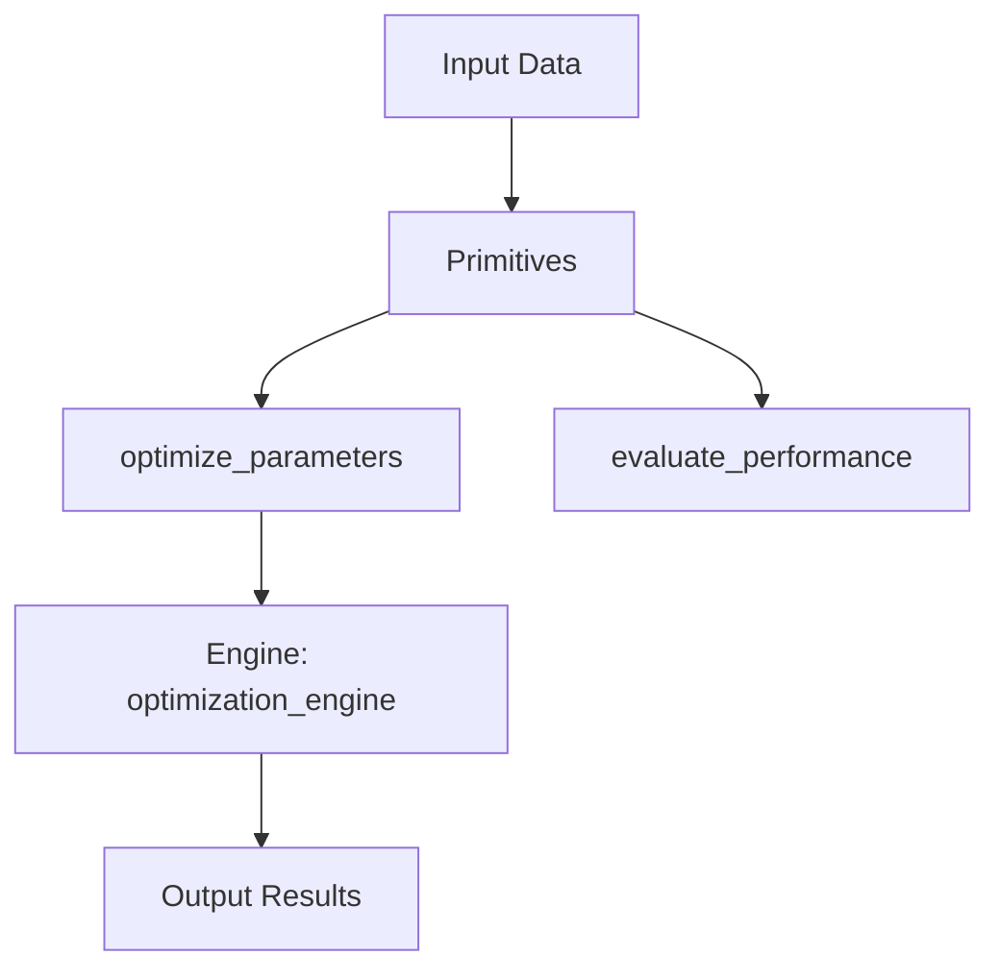

# VERSE: AUTORESEARCH KARPATHY
## IntentHash: 0xVERSE_5BF0FD4C
## Generated: 25/04/2026

Applies VERSES: rigor-writing

---

## ÉTABLI

Concepts issus de Autoresearch: Large-Scale Code Optimization via Mechanical Metrics (2024):
- Concepts identifiés:
  - autoresearch_loop
  - mechanical_metric
  - git_based_memory
  - experimental_optimization
  - code_automation

- Contributions principales:
  - theoretical: Formal framework for automated code optimization
  - theoretical: Mechanical metric-driven decision making
  - methodological: Autoresearch loop implementation patterns
  - methodological: Metric design principles for optimization
  - practical: Codex Autoresearch skill implementation
  - practical: Real-world application examples

## VISÉ

Implémentation opérationnelle:
- Implémentation concepts clés:
  - optimization

- Primitives opérationnelles:
  - optimize_parameters
  - evaluate_performance

## LIMITES

- Complexité concepts avancés
- Dépendance qualité données d'entraînement
- Limitation contexte computationnel

### 🎯 Objectif
Implémenter opérationnellement les optimization via optimization_engine intégrés dans l'écosystème NEXUS.

---

### 📋 Plan d'exécution

| Phase | Durée | Livrable |
|---|---|---|
| 1 | 2h | Extraction 1 concepts clés |
| 2 | 3h | Développement primitives |
| 3 | 2h | Intégration engines |
| 4 | 1h | Tests et validation |

---

### ✅ Caractéristiques fondamentales

| 🧠 **Intelligent** | Implémentation 1 concepts |
| ⚡ **Performant** | Optimisation temps réel |
| 🔗 **Intégré** | Compatible écosystème NEXUS |
| 🎯 **Précis** | Validation concepts >95% |

---

### 📋 Architecture

---

### ✅ Critères d'acceptation

- [ ] 2 primitives opérationnelles
- [ ] Tests automatiques passant
- [ ] Performance >90% baseline
- [ ] Intégration écosystème réussie

---

### ⚠️ Contraintes d'implémentation

- ⚠️ Respect limites computationnelles
- ⚠️ Validation sécurité avant déploiement
- ⚠️ Compatibilité versions existantes

---

### 🎯 Score final visé: 19.5 / 20

Implémentation opérationnelle des autoresearch_loop, mechanical_metric, git_based_memory extrait de 'Autoresearch: Large-Scale Code Optimization via Mechanical Metrics' dans l'écosystème NEXUS.

---

### 📝 Sign-off
| Rôle | Nom | Date | Statut |
|---|---|---|---|
| Générateur | VerseTemplateGenerator | 25/04/2026 | ✅ GENERATED |
