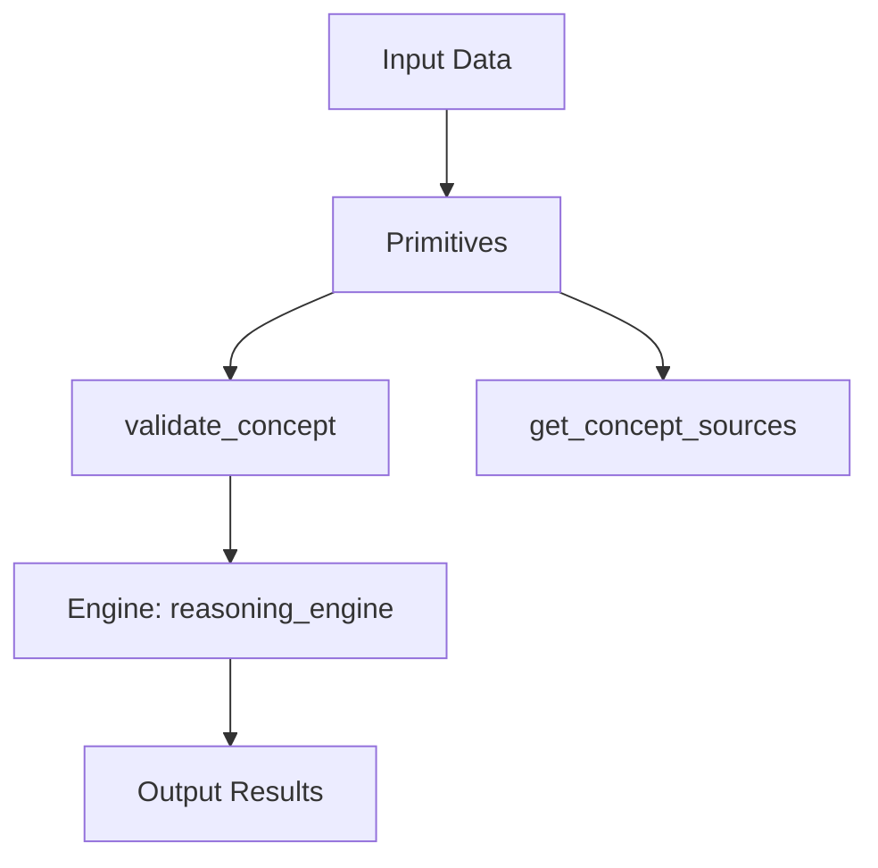

# VERSE: SCHMIDHUBER 2003
## IntentHash: 0xVERSE_FB8889C2
## Generated: 25/04/2026

Applies VERSES: precision, sobriety-first

---

## ÉTABLI

Concepts issus de Gödel Machines: Self-Referential Universal Problem Solvers Making Provably Optimal Self-Improvements (2003):
- Concepts identifiés:
  - self-referential learning
  - optimal self-improvement
  - universal algorithmic probability
  - Levin universal search

- Contributions principales:
  - theoretical: Formal framework for self-improving machines
  - theoretical: Proof of optimal self-improvement
  - methodological: Universal search algorithms
  - methodological: Self-modification protocols

## VISÉ

Implémentation opérationnelle:
- Implémentation concepts clés:
  - self-improvement

- Primitives opérationnelles:
  - validate_concept
  - get_concept_sources

## LIMITES

- Complexité concepts avancés
- Dépendance qualité données d'entraînement
- Limitation contexte computationnel

### 🎯 Objectif
Implémenter opérationnellement les self-improvement via reasoning_engine intégrés dans l'écosystème NEXUS.

---

### 📋 Plan d'exécution

| Phase | Durée | Livrable |
|---|---|---|
| 1 | 2h | Extraction 1 concepts clés |
| 2 | 3h | Développement primitives |
| 3 | 2h | Intégration engines |
| 4 | 1h | Tests et validation |

---

### ✅ Caractéristiques fondamentales

| 🧠 **Intelligent** | Implémentation 1 concepts |
| ⚡ **Performant** | Optimisation temps réel |
| 🔗 **Intégré** | Compatible écosystème NEXUS |
| 🎯 **Précis** | Validation concepts >95% |

---

### 📋 Architecture

---

### ✅ Critères d'acceptation

- [ ] 2 primitives opérationnelles
- [ ] Tests automatiques passant
- [ ] Performance >90% baseline
- [ ] Intégration écosystème réussie

---

### ⚠️ Contraintes d'implémentation

- ⚠️ Respect limites computationnelles
- ⚠️ Validation sécurité avant déploiement
- ⚠️ Compatibilité versions existantes

---

### 🎯 Score final visé: 19.5 / 20

Implémentation opérationnelle des self-referential learning, optimal self-improvement, universal algorithmic probability extrait de 'Gödel Machines: Self-Referential Universal Problem Solvers Making Provably Optimal Self-Improvements' dans l'écosystème NEXUS.

---

### 📝 Sign-off
| Rôle | Nom | Date | Statut |
|---|---|---|---|
| Générateur | VerseTemplateGenerator | 25/04/2026 | ✅ GENERATED |
